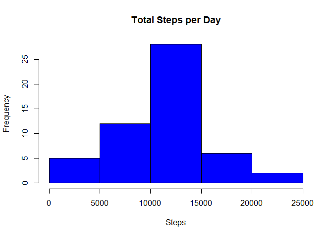
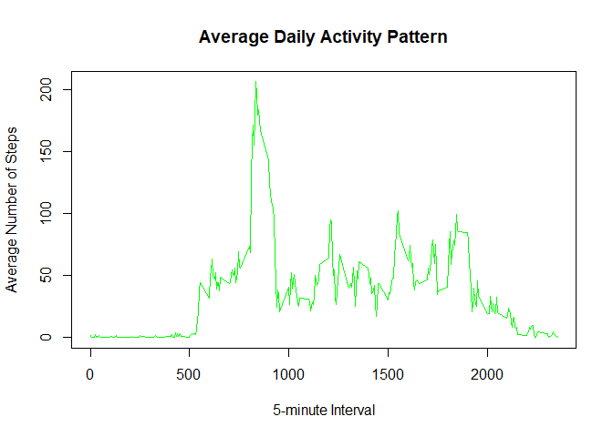
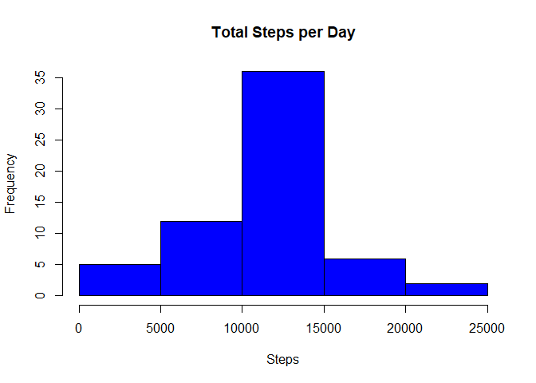
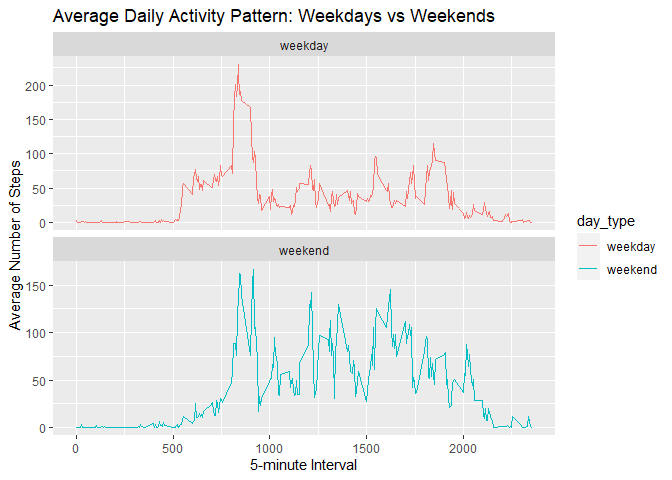

The data for this assignment was downloaded from the course website:

Dataset: [Activity monitoring data](https://d396qusza40orc.cloudfront.net/repdata%2Fdata%2Factivity.zip)

The variables included in this dataset are:

- `steps`: Number of steps taken in a 5-minute interval (missing values are coded as `NA`)
- `date`: The date on which the measurement was taken in YYYY-MM-DD format
- `interval`: Identifier for the 5-minute interval in which the measurement was taken

The dataset is stored in a comma-separated-value (CSV) file called activity, and there are a total of 17,568 observations in this dataset. This csv file is stored in a folder called activity_unzipped.

## Loading the required libraries


```r
library(ggplot2)
```

## Loading and preprocessing the data

Lets now load the activity data into a variable data and check the structure of the same. Then transform the data into a format suitable for our analysis


```r
# Load the data
data <- read.csv("./activity_unzipped/activity.csv")

# Check the structure of the dataset
str(data)
```

```
## 'data.frame':	17568 obs. of  3 variables:
##  $ steps   : int  NA NA NA NA NA NA NA NA NA NA ...
##  $ date    : chr  "2012-10-01" "2012-10-01" "2012-10-01" "2012-10-01" ...
##  $ interval: int  0 5 10 15 20 25 30 35 40 45 ...
```

```r
# Convert the date column to Date type
data$date <- as.Date(data$date, format = "%Y-%m-%d")
```

## What is mean total number of steps taken per day?

For this part of the assignment, we have ignored the missing values in the dataset. Then calculated the total number of steps taken per day. We have then created a histogram of the total number of steps taken each day. We have also calculated and reported the mean and median of the total number of steps taken per day


```r
# Calculate the total number of steps taken per day
total_steps_per_day <- aggregate(steps ~ date, data, sum, na.rm = TRUE)

#Check on how the data looks like post aggregation
head(total_steps_per_day)
```

```
##         date steps
## 1 2012-10-02   126
## 2 2012-10-03 11352
## 3 2012-10-04 12116
## 4 2012-10-05 13294
## 5 2012-10-06 15420
## 6 2012-10-07 11015
```

```r
# Make a histogram of the total number of steps taken each day
hist(total_steps_per_day$steps, main = "Total Steps per Day", xlab = "Steps", col = "blue")
```

<!-- -->

```r
# Calculate and report the mean and median of the total number of steps taken per day
mean_steps_per_day <- mean(total_steps_per_day$steps)
median_steps_per_day <- median(total_steps_per_day$steps)

print(paste0("The mean number of total steps taken per day is ",mean_steps_per_day))
```

```
## [1] "The mean number of total steps taken per day is 10766.1886792453"
```

```r
print(paste0("The median number of total steps taken per day is ",median_steps_per_day))
```

```
## [1] "The median number of total steps taken per day is 10765"
```

## What is the average daily activity pattern?

Make a time series plot of the 5-minute interval (x-axis) and the average number of steps taken, averaged across all days (y-axis)


```r
# Calculate the average number of steps taken in each 5-minute interval across all days
average_steps_per_interval <- aggregate(steps ~ interval, data, mean, na.rm = TRUE)

# Make a time series plot
plot(average_steps_per_interval$interval, average_steps_per_interval$steps, type = "l", 
     main = "Average Daily Activity Pattern", xlab = "5-minute Interval", ylab = "Average Number of Steps", col = "green")
```

<!-- -->

Which 5-minute interval, on average across all the days in the dataset, contains the maximum number of steps?


```r
# Which 5-minute interval contains the maximum number of steps on average?
max_interval <- average_steps_per_interval[which.max(average_steps_per_interval$steps), ]

print(paste0("The interval ",max_interval$interval," on average across all the days, contains the maximum number of steps (",max_interval$steps,")"))
```

```
## [1] "The interval 835 on average across all the days, contains the maximum number of steps (206.169811320755)"
```

## Imputing missing values

Since there are a number of days/intervals where there are missing values (coded as NA). The presence of missing days may introduce bias into some calculations or summaries of the data. 

Lets calculate and report the total number of missing values in the dataset (i.e. the total number of rows with NAs) 


```r
# Calculate the total number of missing values in the dataset
total_na <- sum(is.na(data$steps))

print(paste0("The total number of rows with missing values is ",total_na))
```

```
## [1] "The total number of rows with missing values is 2304"
```

Devise a strategy for filling in all of the missing values in the dataset. The strategy does not need to be sophisticated. For example, you could use the mean/median for that day, or the mean for that 5-minute interval, etc.

**Lets go with using the mean for that 5 min interval across all days to fill in the missing values**

Create a new dataset that is equal to the original dataset but with the missing data filled in.


```r
# Impute missing values using the mean for that 5-minute interval
imputed_data <- data
for (i in 1:nrow(imputed_data)) {
  if (is.na(imputed_data$steps[i])) {
    interval <- imputed_data$interval[i]
    imputed_data$steps[i] <- average_steps_per_interval[average_steps_per_interval$interval == interval, "steps"]
  }
}

# Verify no missing values remain
sum(is.na(imputed_data$steps))
```

```
## [1] 0
```

Lets make a histogram of the total number of steps taken each day.


```r
# Calculate the total number of steps taken per day
total_steps_per_day_imputedData <- aggregate(steps ~ date, imputed_data, sum, na.rm = TRUE)

# Make a histogram of the total number of steps taken each day
hist(total_steps_per_day_imputedData$steps, main = "Total Steps per Day", xlab = "Steps", col = "blue")
```

<!-- -->

Calculate and report the mean and median total number of steps taken per day. Lets check to see if these values differ from the estimates from the first part of the assignment? What is the impact of imputing missing data on the estimates of the total daily number of steps?


```r
# Calculate and report the mean and median of the total number of steps taken per day
mean_steps_per_day_imputedData <- mean(total_steps_per_day_imputedData$steps)
median_steps_per_day_imputedData <- median(total_steps_per_day_imputedData$steps)

print(paste0("The mean total steps per day is ", mean_steps_per_day_imputedData))
```

```
## [1] "The mean total steps per day is 10766.1886792453"
```

```r
print(paste0("The median total steps per day is ",median_steps_per_day_imputedData))
```

```
## [1] "The median total steps per day is 10766.1886792453"
```

**On comparing the mean and median values from before and after imputing we can see that they is not a lot of differences between these values.**

## Are there differences in activity patterns between weekdays and weekends?

Use the imputed dataset for this part.

Create a new factor variable in the dataset with two levels – “weekday” and “weekend” indicating whether a given date is a weekday or weekend day.


```r
# Create a new factor variable for weekday and weekend
imputed_data$day_type <- ifelse(weekdays(imputed_data$date) %in% c("Saturday", "Sunday"), "weekend", "weekday")
imputed_data$day_type <- as.factor(imputed_data$day_type)

#Take quick look at the dataset with the new info
head(imputed_data)
```

```
##       steps       date interval day_type
## 1 1.7169811 2012-10-01        0  weekday
## 2 0.3396226 2012-10-01        5  weekday
## 3 0.1320755 2012-10-01       10  weekday
## 4 0.1509434 2012-10-01       15  weekday
## 5 0.0754717 2012-10-01       20  weekday
## 6 2.0943396 2012-10-01       25  weekday
```

Make a panel plot containing a time series plot of the 5-minute interval (x-axis) and the average number of steps taken, averaged across all weekday days or weekend days (y-axis). 


```r
# Calculate the average number of steps taken in each 5-minute interval across all weekdays or weekends
average_steps_weekday_weekend <- aggregate(steps ~ interval + day_type, imputed_data, mean)

# Make a panel plot
WvW <- ggplot(average_steps_weekday_weekend, aes(x = interval, y = steps, color = day_type)) +
  geom_line() +
  facet_wrap(~day_type, ncol = 1, scales = "free_y") +
  labs(title = "Average Daily Activity Pattern: Weekdays vs Weekends", x = "5-minute Interval", y = "Average Number of Steps")
print(WvW)
```

<!-- -->

**The Average number of steps in the weekend from the 1000th interval to the 2000th interval seems to be on the higher side when compared to the weekdays**
